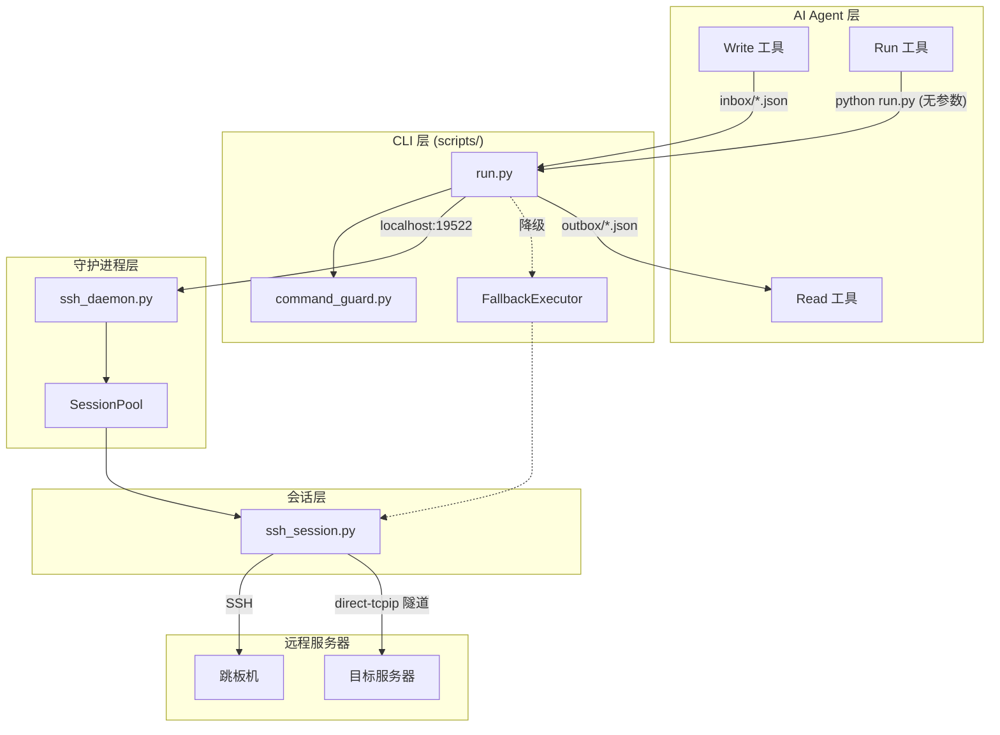
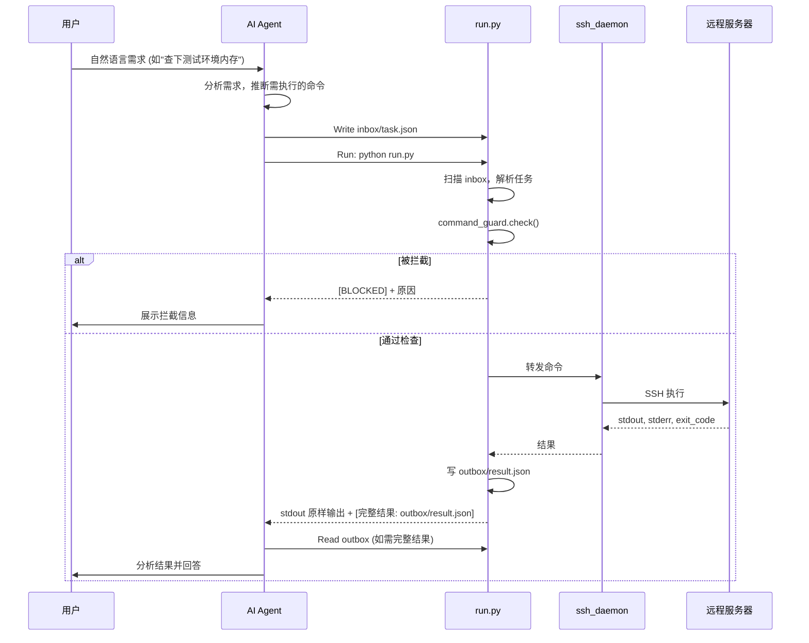
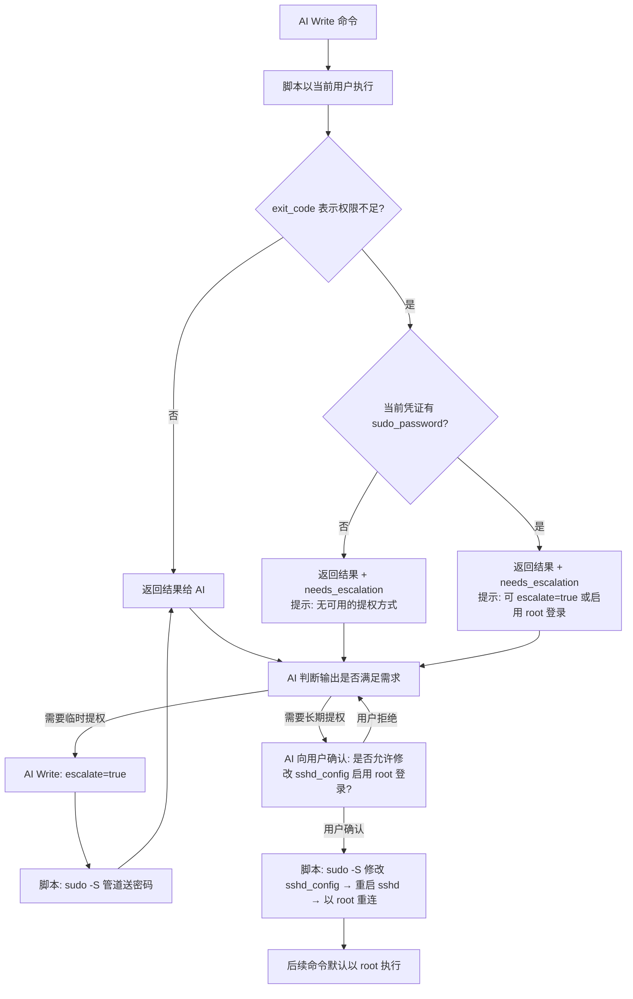

# 《SSH Remote Connection Skill》功能设计说明书

| 项目 | 内容 |
|------|------|
| 文档版本 | V2.0 |
| 编写日期 | 2026-07-22 |
| 编写人 | sdfang |
| 审核人 | sdfang |
| 批准人 | sdfang |
| 文档状态 | 草稿 |

**修订记录**

| 版本 | 日期 | 修改人 | 修改说明 |
|------|------|--------|----------|
| V1.0 | - | - | 初稿（雏形） |
| V2.0 | 2026-07-22 | - | 架构重构：文件桥接、长连接 daemon、安全拦截、跳板穿透 |

---

## 1. 引言

### 1.1 编写目的

本文档用于说明 SSH Remote Connection Skill（以下简称"本 Skill"）的功能设计，是后续详细设计、编码实现和测试验证的主要依据。

**预期读者**：开发人员、AI Skill 设计人员、测试人员、系统运维人员。

### 1.2 项目背景

| 项目 | 说明 |
|------|------|
| 软件系统名称 | SSH Remote Connection Skill |
| 任务提出者 | Skill 使用方 |
| 开发者 | sdfang |
| 用户 | 通过 AI Agent 管理远程 Linux 服务器的运维人员 |
| 与其他系统的关系 | 依赖 AI Agent 的 Write / Run / Read 工具链；通过 SSH 协议与远程 Linux 服务器交互 |

本 Skill 提供 AI Agent 远程操作 Linux 服务器的能力。AI 接收用户的自然语言需求，自行推断需执行的命令并调用本 Skill 完成。当前雏形（V1.0）存在三个核心问题：跨 Shell 传参转义导致命令无法正确传递、每次执行命令都需要重新 SSH 登录、无危险命令控制。V2.0 围绕这三个问题进行架构重构。

### 1.3 术语与缩略语

| 术语/缩略语 | 定义 |
|-------------|------|
| Skill | Claude Code 的可调用能力封装，包含 SKILL.md 定义文件和配套脚本 |
| AI Agent | 运行本 Skill 的 AI 代理程序 |
| daemon | 后台守护进程，常驻内存，维护 SSH 连接池 |
| 文件桥接 | AI 通过文件（而非命令行参数）向脚本传递命令的机制 |
| inbox | AI 写入任务文件的目录 |
| outbox | 脚本写入执行结果的目录 |
| target | 目标服务器 IP 地址，或 `user:pass@host` 格式（兼容直传凭证的临时场景） |
| direct-tcpip | SSH 协议中的通道类型，用于在跳板机上建立 TCP 隧道 |
| sudo -S | sudo 的非交互模式，从 stdin 读取密码 |
| BLOCK | 危险命令拦截的最高级别，始终拒绝执行 |
| WARN | 危险命令拦截的警告级别，force=true 可放行 |

### 1.4 参考资料

| 序号 | 文档名称 | 版本 | 来源 |
|------|----------|------|------|
| 1 | 《SSH Remote Connection Skill 详细设计说明书》 | V2.0 | 本仓库 |
| 2 | 《Claude Code Skill 开发指南》 | - | Anthropic |
| 3 | 《SSH 协议规范 (RFC 4254)》 | - | IETF |
| 4 | 《GB/T 8567-2006 计算机软件文档编制规范》 | 2006 | 国家标准 |

---

## 2. 总体设计

### 2.1 设计目标

**功能目标**：

| 编号 | 目标 | 说明 |
|------|------|------|
| G1 | 跨 Shell 零转义传参 | AI 通过文件传递命令，不经任何 Shell 命令行 |
| G2 | 长连接复用 | 同一服务器多次操作只登录一次 |
| G3 | 危险命令硬拦截 | 脚本层阻断高危命令，AI 无法绕开 |
| G4 | 透明跳板穿透 | AI 无需感知跳板机的存在 |
| G5 | 权限提升 | 权限不足时优先建议启用 root 登录，兜底用 sudo -S |
| G6 | 降级兜底 | daemon 不可用时自动降级为直连 |

**非功能目标**：

| 编号 | 目标 | 说明 |
|------|------|------|
| NF1 | 可靠性 | daemon 崩溃后自动重试拉起；降级保证基本可用 |
| NF2 | 安全性 | BLOCK 级命令底线不可突破；修改 sshd_config 允许 root 登录需用户确认（一次性操作）；日常 sudo 提权由 AI 自主决定，无需逐次确认 |
| NF3 | 跨平台 | daemon 和脚本纯 Python，Windows 可运行 |
| NF4 | 兼容性 | 保留 V1.0 CLI 接口作为降级和兼容方式 |
| NF5 | 透明度 | AI 调用方式统一：Write inbox → Run → 读取 stdout；stdout 截断且信息不完整时才 Read outbox |

### 2.2 设计原则与约束

**设计原则**：

- **文件桥接优先**：命令内容始终通过文件传递，不经过 Shell 命令行
- **机械门禁**：危险命令在脚本层硬拦截，AI 只负责传话
- **模块隔离**：CLI 入口、命令安全、SSH 会话、daemon 连接池各自独立
- **降级优先**：daemon 不可用时自动降级，不阻断 AI 工作流

**技术约束**：

| 约束项 | 说明 |
|--------|------|
| 开发语言 | Python 3.x |
| SSH 库 | paramiko |
| 运行环境 | Windows / Linux / macOS |
| 网络限制 | daemon 仅监听 localhost，不接受远程连接 |
| Agent 平台 | Claude Code CLI |

### 2.3 总体架构设计



**分层说明**：

| 层次 | 职责 | 组件 |
|------|------|------|
| AI Agent 层 | 接收用户需求、推断命令、写任务文件、读结果 | Claude AI + Write/Run/Read 工具 |
| CLI 层 | 扫描任务、安全检查、调度执行、写结果 | run.py, command_guard.py |
| 守护进程层 | 连接池管理、空闲回收、请求路由 | ssh_daemon.py |
| 会话层 | SSH 连接、命令执行、sudo 提权、跳板穿透、SFTP | ssh_session.py |
| 远程服务器 | 被管理的 Linux 服务器 | 跳板机、目标机器 |

### 2.4 功能结构

```
SSH Remote Connection Skill
├── F1. 文件桥接模式 (核心)
├── F2. 长连接会话管理
├── F3. 降级兜底
├── F4. 结果完整性保障
├── F5. 危险命令控制
├── F6. 权限提升
├── F7. 跳板机透明穿透
├── F8. 环境配置管理
└── F9. 文件传输
```

| 模块编号 | 模块名称 | 功能概述 | 优先级 |
|----------|----------|----------|--------|
| F1 | 文件桥接模式 | AI 通过文件传递命令，避免 Shell 转义 | 高 |
| F2 | 长连接会话管理 | daemon 常驻维护连接池，复用 SSH 连接 | 高 |
| F3 | 降级兜底 | daemon 不可用时自动重试拉起或降级直连 | 高 |
| F4 | 结果完整性保障 | stdout 原样输出 + 文件备份，截断引导 AI 读文件 | 中 |
| F5 | 危险命令控制 | BLOCK/WARN/ALLOW 三级硬拦截 | 高 |
| F6 | 权限提升 | 优先启用 root 登录（一次确认）+ sudo -S 兜底 | 中 |
| F7 | 跳板机透明穿透 | direct-tcpip 隧道，AI 无感知 | 中 |
| F8 | 环境配置管理 | env_config.json 集中管理服务器凭证 | 高 |
| F9 | 文件传输 | SFTP 上传下载，复用 daemon 连接 | 中 |

### 2.5 处理流程

**总体业务流程**：



### 2.6 运行环境

| 类别 | 配置要求 |
|------|----------|
| 硬件环境 | 能运行 Python 3.x 的通用 PC/服务器 |
| 操作系统 | AI 运行端：Windows / Linux / macOS；远程端：Linux (SSH 服务) |
| 依赖软件 | Python 3.x, paramiko 库 |
| 网络环境 | AI 端到 daemon：localhost TCP；daemon 到远程服务器：SSH (端口 22 或自定义) |
| 无需数据库 | - |

### 2.7 人工处理过程

- 初始配置：用户告知 AI 服务器凭证，AI 通过 `env: "add"` 调用脚本录入，脚本负责校验和写入
- 危险命令确认：当命令被 WARN 拦截时，用户在 AI 对话中确认后方可执行
- sudo 提权确认：需修改 sshd_config 时，用户在 AI 对话中确认后执行
- daemon 异常：降级模式下提示用户联系管理员

### 2.8 尚未解决的问题

暂无。

---

## 3. 功能模块设计

### 3.1 模块 F1：文件桥接模式

#### 3.1.1 功能描述

AI 通过**文件**而非命令行参数传递命令内容，彻底避免 PowerShell / Git Bash / CMD 对 JSON 的转义破坏。

| 需求编号 | 需求名称 | 实现方式 |
|----------|----------|----------|
| REQ-F1-01 | 命令传递不经 Shell | AI 用 Write 工具写文件，Run 工具无参调用脚本 |
| REQ-F1-02 | AI 能获取完整结果 | 脚本将结果写文件，AI 用 Read 工具读取 |

#### 3.1.2 输入 / 输出

| 类型 | 名称 | 数据类型 | 约束条件 | 说明 |
|------|------|----------|----------|------|
| 输入 | inbox 任务文件 | JSON 文件 | 必须包含 task_id、target、command | AI 通过 Write 工具写入 |
| 输入 | run.py 调用 | 命令行 | 无参数 | AI 通过 Run 工具调用 |
| 输出 | stdout | 文本流 | 原样输出命令的 stdout/stderr + 文件路径 | AI 的 Run 工具直接展示 |
| 输出 | outbox 结果文件 | JSON 文件 | 包含 stdout、stderr、exit_code、elapsed | AI 通过 Read 工具读取 |

#### 3.1.3 业务规则

1. 命令内容在 JSON 文件中以原始字符串存储，不经任何转义
2. 每次任务只能指定以下五种操作之一：`command`（执行命令）、`upload`（上传）、`download`（下载）、`session`（会话管理）、`env`（环境配置管理）
3. `as` 字段可选，指定用哪组凭证登录。不填则使用环境的 `default_credential`
4. 脚本扫描 inbox 目录时按文件创建时间排序，顺序执行
5. 任务执行完成后，对应的 inbox 文件被删除
6. inbox 文件固定命名为 `task.json`，outbox 固定命名为 `result.json`。AI 每次 Write 覆写同一文件，无需新建。文件名不带 task_id — task_id 仅作为 JSON body 内的字段，用于关联请求和结果

7. task_id 生成规则：
   - 格式：`task_N`（N 为从 1 开始的递增序号），如 `task_1`、`task_2`
   - 日常单个命令执行时每次使用 `task_1` 即可（反正文件覆写）。多任务并行时用 `task_1`、`task_2` 区分
   - **重试时必须用同一个 task_id**（force=true、escalate=true、权限不足换凭证 等场景），保证 result.json 中能看到前后两次执行结果，方便 AI 对比判断

#### 3.1.5 异常处理

| 异常场景 | 系统响应 | 提示信息 |
|----------|----------|----------|
| inbox 为空 | 静默退出 | stderr: "没有待执行的任务" |
| JSON 格式错误 | 写 outbox 错误信息 | stderr + outbox: "JSON 解析失败" |
| 多个顶层字段同时存在 | 写 outbox 错误信息 | outbox: "只能指定一种操作 (command/upload/download/session/env)" |
| 无任何顶层操作字段 | 写 outbox 错误信息 | outbox: "必须指定 command/upload/download/session/env 之一" |

---

### 3.2 模块 F2：长连接会话管理

#### 3.2.1 功能描述

`ssh_daemon.py` 作为后台守护进程常驻运行，维护一个 SSH 连接池。AI 通过同一个 target 多次执行命令时，复用已有 SSH 连接，避免每次重新登录。同时提供会话管理能力。

| 需求编号 | 需求名称 | 实现方式 |
|----------|----------|----------|
| REQ-F2-01 | 连接复用 | daemon 维护 SessionPool，按 target 查找已有连接 |
| REQ-F2-02 | 心跳保活 | 空闲连接每 60s 发送 keepalive 包 |
| REQ-F2-03 | 空闲回收 | 会话 300s 无活动自动关闭 |
| REQ-F2-04 | 会话管理 | 通过 `session` 字段：`"list"` 查看会话 / `"disconnect"` 断开连接 |

#### 3.2.2 输入 / 输出

| 类型 | 名称 | 数据类型 | 约束条件 | 说明 |
|------|------|----------|----------|------|
| 输入 | 查看会话 | inbox JSON | `"session": "list"` | 查看活跃会话 |
| 输入 | 断开连接 | inbox JSON | `"session": "disconnect"`, 需指定 target | 断开指定会话 |
| 输出 | 会话列表 | `outbox/result.json` | sessions 数组 | 每项含 target、host、username、idle_seconds |
| 输出 | 断开确认 | `outbox/result.json` | stdout 含确认信息 | - |

#### 3.2.3 业务规则

1. 会话按 IP + 凭证名称精确匹配。target 就是 IP，同 IP 同凭证复用一条连接
2. 同一 target 已有会话时，新 connect 请求幂等返回已有 session_id，不重复登录
3. daemon 进程**不主动退出**（仅 shutdown 命令可关闭）
4. daemon 意外退出时，下次 run.py 调用自动重试拉起

---

### 3.3 模块 F3：降级兜底

#### 3.3.1 功能描述

当 daemon 不可用时，run.py 自动重试拉起（最多 3 次、间隔 2 秒）；仍失败则降级为直连模式（每次新建 paramiko 连接）。降级行为对 AI 任务流程透明。

| 需求编号 | 需求名称 | 实现方式 |
|----------|----------|----------|
| REQ-F3-01 | daemon 自动拉起 | run.py 检测端口不通后 subprocess.Popen 启动 daemon |
| REQ-F3-02 | 重试机制 | 最多 3 次，间隔 2 秒 |
| REQ-F3-03 | 降级直连 | FallbackExecutor 每次新建连接 |
| REQ-F3-04 | 启动成功标准 | 子进程创建且 TCP 端口 5 秒内可连接 |

#### 3.3.3 业务规则

1. **不判断失败原因**：不区分进程崩溃、端口异常、未启动，统一重试
2. **不做 PID 检测**：简化设计，不写 PID 文件
3. **降级后不再重试**：本次 run.py 调用内，一旦进入降级模式，后续任务不再尝试恢复 daemon
4. **下一条命令重试**：下次 run.py 被调用时，重新开始重试拉起的流程

#### 3.3.5 异常处理

| 异常场景 | 系统响应 | 提示信息 |
|----------|----------|----------|
| daemon 端口不通 | 重试拉起 | stderr: "daemon 启动失败 (第 n/3 次): ..." |
| 3 次重试耗尽 | 降级为直连 | stderr: 逐条输出每次重试的失败原因，最后输出"daemon 无法启动 (已重试 3 次)，降级为直连模式。请根据以上错误排查或联系管理员。" |
| 降级模式下执行命令 | 正常执行（每次新建连接） | 无额外提示 |

---

### 3.4 模块 F4：结果完整性保障

#### 3.4.1 功能描述

run.py 将命令的 stdout/stderr 原样输出到终端，同时将完整结果（stdout、stderr、exit_code、耗时）写入 `ssh-connect/outbox/result.json` 文件。stdout 末尾固定输出文件路径。当 Agent 截断 stdout 时，AI 被引导去读取完整文件。

| 需求编号 | 需求名称 | 实现方式 |
|----------|----------|----------|
| REQ-F4-01 | 原样输出 | run.py 不截断 stdout/stderr |
| REQ-F4-02 | 文件备份 | 完整结果（stdout、stderr、exit_code、elapsed）写入 `outbox/result.json` 文件 |
| REQ-F4-03 | 截断引导 | stdout 末尾固定输出文件路径提示 |

#### 3.4.3 业务规则

1. **禁止**在读取完整结果文件前换命令重试——这是唯一不可违反的规则
2. 当 stdout 被截断且所需信息不完整时，AI 应 Read outbox 获取完整结果
3. 如果截断位置之前已经包含全部的有效信息，则无需额外读文件

---

### 3.5 模块 F5：危险命令控制

#### 3.5.1 功能描述

脚本层**硬拦截**危险命令，AI 做传话人，两层协同。

| 拦截级别 | 行为 | 典型命令 |
|----------|------|----------|
| **BLOCK** | 直接拒绝，即使 force=true 也不放行 | `rm -rf /`、`dd of=/dev/sda`、`mkfs.*`、fork bomb |
| **WARN** | 拒绝执行，force=true 可放行 | `rm -rf <path>`、`sed -i`、`kill -9`、`shutdown` |
| **ALLOW** | 直接放行 | `ls`、`cat`、`ps`、`df`、`grep`、`echo` 等读命令 |

| 需求编号 | 需求名称 | 实现方式 |
|----------|----------|----------|
| REQ-F5-01 | BLOCK 硬拦截 | command_guard 正则匹配，直接拒绝且不执行 |
| REQ-F5-02 | WARN 需确认 | AI 向用户展示拦截原因，用户确认后 force=true 重新执行 |
| REQ-F5-03 | force 放行范围 | force 只提升 WARN 到 ALLOW，BLOCK 始终拒绝 |

#### 3.5.2 输入 / 输出

| 类型 | 名称 | 数据类型 | 约束条件 | 说明 |
|------|------|----------|----------|------|
| 输入 | force 字段 | bool | 默认 false | AI 在用户确认后设为 true |
| 输出 | 拦截结果 | `outbox/result.json` | blocked=true, level, reason | - |
| 输出 | stdout 拦截提示 | 文本 | `[BLOCKED] 原因` | - |

#### 3.5.3 业务规则

1. BLOCK 是底线，force=true 也不能突破
2. 用户确认后，AI 重新 Write **同名** task_id 的任务文件（覆写）并设置 force=true
3. AI **必须**向用户展示被拦截的命令及原因，不得私自设置 force=true

#### 3.5.5 异常处理

| 异常场景 | 系统响应 | 提示信息 |
|----------|----------|----------|
| 命令命中 BLOCK | 拒绝执行 | `[BLOCKED] {原因}` |
| 命令命中 WARN | 拒绝执行 | `[BLOCKED] {原因}` + 提示 force=true 可放行 |

---

### 3.6 模块 F6：权限提升

#### 3.6.1 功能描述

多数命令无需 root 即可执行，脚本**先以当前用户直接执行**。仅当命令因权限不足失败时，AI 才决策如何提权。

**提权策略优先级**：

| 优先级 | 方式 | 是否需用户确认 | 说明 |
|--------|------|----------------|------|
| 1（推荐） | 修改 sshd_config 允许 root 登录 | **是**（一次性） | 修改后 daemon 以 root 重连，后续所有命令均以 root 执行，一劳永逸 |
| 2（兜底） | `escalate: true` + sudo -S | 否（AI 自主） | 每次执行时带 escalate=true 走 sudo，适合临时高权限操作 |

**为什么优先改 sshd_config 而非 sudo**：同一个环境反复需要 root 时，每次都 sudo 效率低且日志噪音大。一次改 sshd_config，后续命令全部直接以 root 执行。

**提权流程**：



| 需求编号 | 需求名称 | 实现方式 |
|----------|----------|----------|
| REQ-F6-01 | 普通执行优先 | 命令以当前用户直接执行，不自动附加 sudo |
| REQ-F6-02 | 权限不足感知 | 分析 stderr 中的 "permission denied" 等信息 |
| REQ-F6-03 | escalate 兜底 | AI 设置 `escalate: true` 后，脚本使用 `sudo -S` + stdin 管道送密码 |
| REQ-F6-04 | 启用 root 登录（推荐） | 经用户一次确认后，修改 sshd_config 允许 root 登录，daemon 以 root 重连 |

#### 3.6.2 输入 / 输出

| 类型 | 名称 | 数据类型 | 约束条件 | 说明 |
|------|------|----------|----------|------|
| 输入 | escalate 字段 | bool | 默认 false | AI 设为 true 时走 sudo -S |
| 输入 | sudo_password | string | credential 中 | sudo 密码 |
| 输出 | needs_escalation | bool | outbox 中 | true 表示有提权路径可用 |
| 输出 | escalation_options | list | outbox 中 | 可用选项：["escalate", "enable_root_login"] |

#### 3.6.3 业务规则

1. 脚本**不自动提权**
2. 优先级：改 sshd_config 允许 root 登录 > escalate: true（sudo -S）
3. **改 sshd_config 需用户一次确认**，确认后脚本自动执行，后续无需再确认
4. **escalate: true 无需逐次确认**，AI 自主决定，`escalate` 只对当次有效
5. AI 可也通过 `as` 切换凭证（如从 admin 切到 root），这是另一种提权路径

---

### 3.7 模块 F7：跳板机透明穿透

#### 3.7.1 功能描述

**透明性分两个阶段，含义不同**：

| 阶段 | AI 是否感知跳板机 | 说明 |
|------|--------------------|------|
| 环境配置 | **是** — AI 需引导用户录入跳板机凭证，并在目标环境配置中设置 `via` 字段 | 配置通过 `env: "add"` 由脚本校验写入 |
| 命令执行 | **否** — AI 只需在 task 中指定最终 target（如"10.0.1.5"） | 脚本自动解析 via 链、连接跳板机、建立隧道、连接目标 |

脚本使用 paramiko 的 `direct-tcpip` channel 在跳板机上建立 TCP 隧道，然后在隧道上连接目标机器。整个过程在 SSH 传输层完成，不涉及 shell 命令嵌套。

**跳板机场景的连接生命周期**：

跳板机和目标机**各自在 SessionPool 中保有一条长连接**，都受心跳保活和空闲回收：

- 目标机的 SSHSession 持有一个对跳板机 SSHSession 的引用
- `direct-tcpip` 通道在连接建立时一次性创建，后续命令执行**不重复建隧道**
- 两个 session 各有独立的心跳线程，各自保活
- 跳板机 session 断开 → 依赖它的目标 session 标记为 stale → 下次访问时自动从跳板机起重建隧道和连接

| 需求编号 | 需求名称 | 实现方式 |
|----------|----------|----------|
| REQ-F7-01 | 跳板声明 | env_config.json 中 target 的 via 字段引用跳板机 IP |
| REQ-F7-02 | 隧道建立（一次性） | paramiko transport.open_channel('direct-tcpip')，连接时创建，后续复用 |
| REQ-F7-03 | 执行时透明 | AI 写 task 时只需指定最终 target，脚本自动解析 via 链 |
| REQ-F7-04 | 双长连接 | 跳板机和目标机各自在 SessionPool 中保活，独立心跳 |

#### 3.7.2 输入 / 输出

| 类型 | 名称 | 数据类型 | 约束条件 | 说明 |
|------|------|----------|----------|------|
| 输入 | via 字段 | string | 必须在 environments 中已定义 | 跳板机 IP |
| 输入 | 跳板机配置 | 环境配置对象 | 必须有 host、username、password | 用于连接跳板机 |

#### 3.7.3 业务规则

1. 配置环境时，AI 引导用户分别录入跳板机和目标机器的 IP 及凭证，通过 `env: "add"` 分别录入，目标机器设置 `via` 字段指向跳板机 IP
2. 执行命令时，AI 的任务文件中只需写 `target: "10.0.1.5"`（目标 IP），无需提及跳板机
3. 脚本在 daemon 内部解析 `via` → 先连跳板机 → 建隧道 → 连目标 → 在目标上执行命令

---

### 3.8 模块 F8：环境配置管理

#### 3.8.1 功能描述

所有服务器连接信息集中在 `ssh-connect/scripts/env_config.json`，由脚本统一管理。**AI 不直接编辑此文件**，而是通过 inbox 任务中的 `env` 字段调用脚本提供的环境管理功能。

一个环境支持配置**多组凭证**（如 admin 和 root 各一组）。AI 执行命令时可通过 `as` 字段选择使用哪组凭证，不指定则使用默认凭证。

| 需求编号 | 需求名称 | 实现方式 |
|----------|----------|----------|
| REQ-F8-01 | 环境信息存储 | env_config.json 集中管理 |
| REQ-F8-02 | 多凭证支持 | 每个环境的 credentials 数组可包含多组账号密码 |
| REQ-F8-03 | 环境增删改查 | AI Write inbox (通过 `env` 字段) → Run → 脚本验证并写入配置 |
| REQ-F8-04 | 未知环境引导 | SKILL.md 指导 AI 询问用户凭证，然后通过 `env: "add"` 录入 |

**支持的环境管理操作**：

| env 值 | 额外参数 | 说明 |
|--------|----------|------|
| `list` | 无 | 列出所有已配置的环境（按 IP）、凭证列表（密码脱敏） |
| `add` | env_name (IP), config | 新增一个环境，env_name 即服务器 IP |
| `update` | env_name (IP), config | 更新已有环境的部分字段 |
| `remove` | env_name (IP) | 删除指定环境 |
| `credential_add` | env_name (IP), credential | 为已有环境新增一组凭证 |
| `credential_remove` | env_name (IP), credential_name | 删除环境的某组凭证 |

**环境管理不经过 daemon**：`env` 操作只涉及本地文件读写，run.py 直接处理。

#### 3.8.2 输入 / 输出

`env: "add"` 任务示例（含多组凭证）：

```json
{
    "task_id": "20260722_env_001",
    "env": "add",
    "env_name": "192.168.1.100",
    "config": {
        "host": "192.168.1.100",
        "credentials": [
            {
                "name": "admin",
                "username": "admin",
                "password": "123",
                "sudo_password": "456"
            },
            {
                "name": "root",
                "username": "root",
                "password": "456"
            }
        ],
        "default_credential": "admin"
    }
}
```

`env: "add"` 返回：
```json
{
    "task_id": "20260722_env_001",
    "success": true,
    "stdout": "已添加环境: 测试环境 (192.168.1.100), 凭证: admin, root"
}
```

`env: "credential_add"` 任务示例：

```json
{
    "task_id": "20260722_cred_001",
    "env": "credential_add",
    "env_name": "192.168.1.100",
    "credential": {
        "name": "deploy",
        "username": "deploy",
        "password": "deploy_pass",
        "sudo_password": "root_pass"
    }
}
```

#### 3.8.3 配置字段说明

**环境级别字段**：

| 字段 | 必填 | 类型 | 默认值 | 说明 |
|------|------|------|--------|------|
| host | 是 | string | - | 服务器 IP |
| port | 否 | int | 22 | SSH 端口 |
| via | 否 | string | - | 跳板机 IP |
| credentials | 是 | array | - | 凭证列表，至少一组 |
| default_credential | 是 | string | - | 默认使用的凭证名称 |

**凭证 (credential) 字段**：

| 字段 | 必填 | 类型 | 说明 |
|------|------|------|------|
| name | 是 | string | 凭证别名，如 "admin"、"root"，在同一环境内唯一 |
| username | 是 | string | SSH 用户名 |
| password | 是 | string | SSH 密码 |
| sudo_password | 否 | string | sudo 提权密码（若与 password 不同） |

**校验规则**：
- host、credentials 为必填字段
- credentials 至少包含一组凭证
- 每组凭证的 name、username、password 为必填
- credential name 在同一环境（同一 IP）内不得重复
- default_credential 必须匹配 credentials 中某一组的 name
- via 填写目标 IP，该 IP 必须在 environments 中已配置
- env_name 即 IP，不得重复（IP 天然唯一）

#### 3.8.4 与 F1 的配合：as 字段

AI 执行命令时，通过 task 中的 `as` 字段选择凭证：

```json
{
    "task_id": "20260722_cmd_001",
    "target": "192.168.1.100",
    "command": "systemctl restart nginx",
    "as": "root"
}
```

不写 `as` 则使用 default_credential。AI 可根据当前用户的权限情况，灵活选择用哪组凭证执行命令。

daemon 配置字段：

| 字段 | 必填 | 类型 | 默认值 | 说明 |
|------|------|------|--------|------|
| daemon.host | 否 | string | 127.0.0.1 | daemon 监听地址 |
| daemon.port | 否 | int | 19522 | daemon 监听端口 |
| daemon.session_idle_timeout | 否 | int | 300 | 会话空闲超时(秒) |
| daemon.heartbeat_interval | 否 | int | 60 | 心跳间隔(秒) |

---

### 3.9 模块 F9：文件传输

#### 3.9.1 功能描述

支持通过 SFTP 上传/下载文件，同样走文件桥接模式，复用 daemon 的 SSH 连接，无需额外认证。

| 需求编号 | 需求名称 | 实现方式 |
|----------|----------|----------|
| REQ-F9-01 | 上传文件 | inbox 写入 upload 操作，local 为 Windows 路径，remote 为 Linux 路径 |
| REQ-F9-02 | 下载文件 | inbox 写入 download 操作，remote 为 Linux 路径，local 为 Windows 路径 |
| REQ-F9-03 | 连接复用 | 复用 daemon 的 SSH 连接打开 SFTP channel |

---

## 4. 接口设计

### 4.1 用户接口

AI Agent 是本 Skill 的唯一"用户"。调用方式为三步固定模式：

**步骤 1**：Write 工具写入 `ssh-connect/inbox/task.json`（每次覆写，不新建）
**步骤 2**：Run 工具执行 `python ssh-connect/scripts/run.py`（无参数），读取 stdout 输出
**步骤 3**：stdout 被截断且信息不完整时，Read 工具读取 `ssh-connect/outbox/result.json`（每次覆写）

stdout 未被截断或已包含所需信息时，步骤 3 可跳过。AI 不应通过 --json 命令行参数传任务（该方式仅为兼容保留）。

### 4.2 外部接口

本 Skill 与远程 Linux 服务器的 SSH 通信使用 paramiko 库（SSH 协议），无其他外部系统接口。

### 4.3 内部接口

#### 4.3.1 文件桥接接口（run.py ↔ AI Agent）

| 接口编号 | 接口名称 | 提供方 | 调用方 | 协议/方式 | 数据格式 | 说明 |
|----------|----------|--------|--------|-----------|----------|------|
| IF-01 | inbox 任务文件 | AI Agent | run.py | 文件系统 | JSON | 见下方详细格式 |
| IF-02 | outbox 结果文件 | run.py | AI Agent | 文件系统 | JSON | 见下方详细格式 |
| IF-03 | stdout 输出 | run.py | AI Agent | 进程 stdout | 文本 | 原样输出 + 末尾文件路径 |

**IF-01 inbox 任务文件格式**：

执行命令示例：
```json
{
    "task_id": "20260722_120000_001",
    "target": "192.168.1.100",
    "command": "free -h",
    "timeout": 30,
    "force": false
}
```

上传文件示例：
```json
{
    "task_id": "20260722_120000_002",
    "target": "192.168.1.100",
    "upload": {
        "local": "C:/Users/xxx/app.jar",
        "remote": "/opt/app/app.jar"
    }
}
```

会话管理示例：
```json
{
    "task_id": "20260722_120000_004",
    "session": "list"
}
```

```json
{
    "task_id": "20260722_120000_005",
    "session": "disconnect",
    "target": "192.168.1.100"
}
```

环境管理示例：
```json
{
    "task_id": "20260722_env_001",
    "env": "add",
    "env_name": "192.168.1.100",
    "config": {
        "host": "192.168.1.100",
        "credentials": [
            {"name": "admin", "username": "admin", "password": "123"}
        ],
        "default_credential": "admin"
    }
}
```

**IF-02 outbox 结果文件格式**：

正常执行结果：
```json
{
    "task_id": "20260722_120000_001",
    "success": true,
    "exit_code": 0,
    "stdout": "Mem: 7.6G ...",
    "stderr": "",
    "elapsed": 1.23,
    "blocked": false
}
```

被拦截结果：
```json
{
    "task_id": "20260722_120000_001",
    "success": false,
    "exit_code": 1,
    "stdout": "",
    "stderr": "",
    "elapsed": 0.01,
    "blocked": true,
    "level": "warn",
    "reason": "递归强制删除"
}
```

#### 4.3.2 daemon 通信接口（run.py ↔ ssh_daemon）

| 接口编号 | 接口名称 | 提供方 | 调用方 | 协议/方式 | 数据格式 | 说明 |
|----------|----------|--------|--------|-----------|----------|------|
| IF-04 | daemon RPC | ssh_daemon | run.py | TCP (localhost:19522) | JSON-line | 每行一个完整 JSON，\n 分隔 |

支持的方法：`ping`、`connect`、`execute`、`upload`、`download`、`disconnect`、`list_sessions`、`is_connected`、`shutdown`。详细请求/响应格式见《详细设计说明书》。

#### 4.3.3 环境配置接口（run.py ↔ env_config.json）

| 接口编号 | 接口名称 | 提供方 | 调用方 | 协议/方式 | 数据格式 | 说明 |
|----------|----------|--------|--------|-----------|----------|------|
| IF-05 | 环境配置 | env_config.json | run.py, ssh_daemon | 文件系统 | JSON | 服务器凭证、跳板关系、daemon 参数 |

---

## 5. 数据设计

### 5.1 数据模型

本 Skill 不涉及数据库。所有数据以 JSON 文件形式存储，包含三类核心数据结构：配置、任务、结果。它们之间通过文件系统关联：

- 一个 `env_config.json` 包含一组环境配置。每个环境可通过 `via` 字段引用另一个环境（跳板关系）
- 每个 inbox 任务文件对应唯一一个 outbox 结果文件（通过 `task_id` 关联）
- 任务中的 `target` 字段引用环境配置中的 IP

### 5.2 主要数据结构设计

#### 5.2.1 env_config.json 完整结构

```json
{
    "daemon": {
        "host": "127.0.0.1",
        "port": 19522,
        "session_idle_timeout": 300,
        "heartbeat_interval": 60
    },
    "environments": {
        "192.168.1.100": {
            "host": "192.168.1.100",
            "port": 22,
            "credentials": [
                {
                    "name": "admin",
                    "username": "admin",
                    "password": "123",
                    "sudo_password": "456"
                },
                {
                    "name": "root",
                    "username": "root",
                    "password": "456"
                }
            ],
            "default_credential": "admin"
        },
        "203.0.113.1": {
            "host": "203.0.113.1",
            "credentials": [
                {
                    "name": "ops",
                    "username": "ops",
                    "password": "ops_password"
                }
            ],
            "default_credential": "ops"
        },
        "10.0.1.5": {
            "host": "10.0.1.5",
            "port": 22,
            "via": "203.0.113.1",
            "credentials": [
                {
                    "name": "app",
                    "username": "app",
                    "password": "app_password",
                    "sudo_password": "root_password"
                }
            ],
            "default_credential": "app"
        }
    }
}
```

#### 5.2.2 会话信息结构

| 数据项名称 | 类型 | 说明 |
|------------|------|------|
| session_id | string (UUID) | 会话唯一标识 |
| target | string | 目标 IP |
| credential_name | string | 使用的凭证名称（如 "admin"、"root"） |
| host | string | 服务器 IP |
| username | string | 登录用户名 |
| created_at | float (timestamp) | 创建时间 |
| last_activity | float (timestamp) | 最后活跃时间 |
| idle_seconds | int | 空闲秒数 |

#### 5.2.3 Target 解析顺序

```
输入 target 字符串
  ├── 1. 作为 IP 在 environments 中精确匹配 key → 使用该配置
  ├── 2. 格式为 user/pass@host → 直接提取 username、password、host（临时凭证，不走 daemon 长连接）
  └── 3. 都不匹配 → 返回错误
```

---

## 6. 运行设计

### 6.1 运行模块组合

| 运行场景 | 参与模块 | 说明 |
|----------|----------|------|
| 长连接模式 (正常) | run.py + ssh_daemon + ssh_session | daemon 维持连接池 |
| 降级模式 (daemon 不可用) | run.py + ssh_session (直连) | 每次新建连接 |
| 守护进程模式 | ssh_daemon + ssh_session | 后台驻留，监听 TCP |

### 6.2 运行控制

- **daemon 启动**：run.py 检测端口不通时，通过 subprocess.Popen 在后台启动 ssh_daemon.py
- **daemon 关闭**：通过 daemon RPC 发送 `shutdown` 请求；或在终端直接 kill 进程
- **重试控制**：最多 3 次，间隔 2 秒。启动成功标准：子进程创建 + 端口 5 秒内可连接
- **降级控制**：重试耗尽后自动降级，本次 run.py 调用不再尝试恢复

### 6.3 运行时间

| 操作 | 预期耗时 | 说明 |
|------|----------|------|
| daemon 启动 | < 2s | Python 进程启动 + 端口绑定 |
| SSH 连接（直连） | < 5s | 取决于网络延迟 |
| SSH 连接（跳板机） | < 10s | 两次 SSH 握手 |
| 命令执行 | 取决于命令本身 | 默认超时 30s，最长 3600s |
| 空闲心跳 | 每 60s | 不影响正常命令 |
| 会话空闲回收 | 300s | - |

---

## 7. 安全与可靠性设计

### 7.1 安全性设计

| 安全措施 | 对应模块 | 说明 |
|----------|----------|------|
| 命令硬拦截 | F5 | BLOCK 级始终拒绝，force 也无法突破 |
| 用户确认机制 | F5, F6 | WARN 级命令和 sshd_config 修改需用户确认 |
| daemon 仅监听 localhost | F2 | 不接受远程 TCP 连接 |
| 凭证集中管理 | F8 | env_config.json 中的密码为明文（依赖文件系统权限保护） |
| 不自动提权 | F6 | sshd_config 修改必须用户确认 |

### 7.2 出错处理设计

#### 7.2.1 出错信息

| 错误/故障情况 | 系统输出信息 | 含义 | 处理方法 |
|---------------|-------------|------|----------|
| daemon 端口不通 | daemon 启动失败 (第 n/3 次): {原因} | daemon 未运行或崩溃 | 自动重试拉起 |
| 3 次重试耗尽 | daemon 无法启动 (已重试 3 次): {每次错误原因}，降级为直连模式 | daemon 持续无法启动 | 降级直连；保留每次错误原因供排查 |
| SSH 认证失败 | 认证失败: 用户名或密码错误 | 凭证错误 | 写入 `outbox/result.json`；AI 提示用户 |
| SSH 连接超时 | 连接超时: host:port | 网络不通或 SSH 未启动 | 写入 `outbox/result.json` |
| 命令执行超时 | 命令执行超时 (30s) | 命令运行超过时限 | 写入 `outbox/result.json` |
| 命令被 BLOCK | [BLOCKED] {原因} | 命中高危规则 | 写入 `outbox/result.json`；流程终止 |
| 命令被 WARN | [BLOCKED] {原因} | 命中警告规则 | 写入 `outbox/result.json`；等待用户确认 |
| sudo 密码错误 | sudo 密码错误 / 不在 sudoers | sudo_password 不正确 | 写入 `outbox/result.json`；AI 提示用户 |
| 跳板机连接失败 | 跳板机连接失败: {原因} | 跳板机不可达或凭证错误 | 写入 `outbox/result.json` |
| SFTP 错误 | 上传/下载失败: {原因} | 文件不存在或权限不足 | 写入 `outbox/result.json` |

#### 7.2.2 补救措施

| 故障类型 | 后备技术 | 恢复技术 |
|----------|----------|----------|
| daemon 崩溃 | 降级为直连模式 | 下次 run.py 调用自动重试拉起 |
| SSH 连接断开 | 心跳检测 + 标记 stale | 下次执行前自动重连 |
| 跳板机断开 | 同上 | 关闭目标会话 + 重建跳板机连接 + 重建隧道 |

### 7.3 系统维护设计

- `session: "list"` 可随时查看 daemon 中活跃的会话
- `session: "disconnect"` 可手动断开异常的会话
- stderr 日志输出包含 daemon 启动、重试、降级等运维信息

---

## 8. 需求追踪矩阵

| 需求编号 | 需求名称 | 设计章节 | 状态 |
|----------|----------|----------|------|
| REQ-F1 | 文件桥接模式 | 3.1 | 已覆盖 |
| REQ-F2 | 长连接会话管理 | 3.2 | 已覆盖 |
| REQ-F3 | 降级兜底 | 3.3 | 已覆盖 |
| REQ-F4 | 结果完整性保障 | 3.4 | 已覆盖 |
| REQ-F5 | 危险命令控制 | 3.5 | 已覆盖 |
| REQ-F6 | 权限提升 | 3.6 | 已覆盖 |
| REQ-F7 | 跳板机透明穿透 | 3.7 | 已覆盖 |
| REQ-F8 | 环境配置管理 | 3.8 | 已覆盖 |
| REQ-F9 | 文件传输 | 3.9 | 已覆盖 |

---

## 9. 附录

（暂无）
