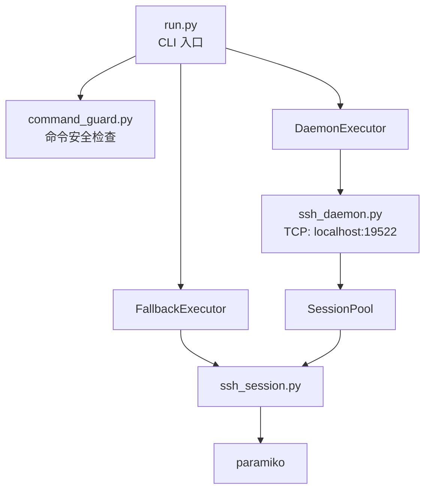
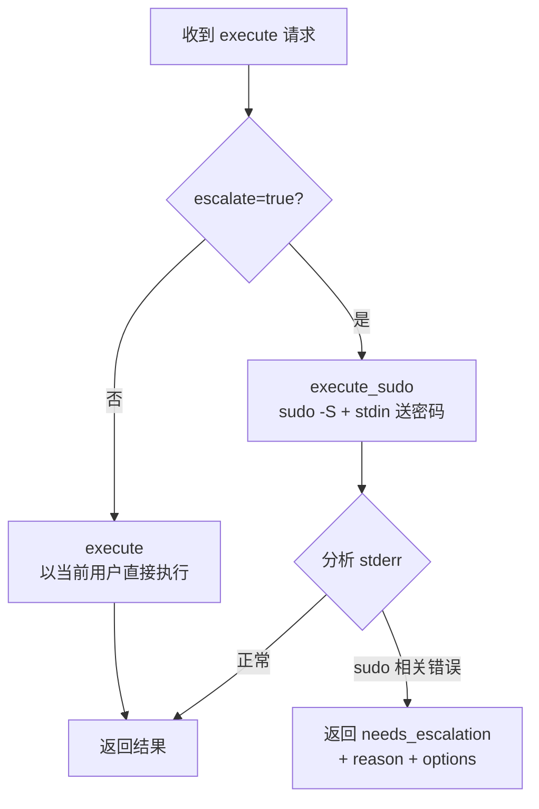
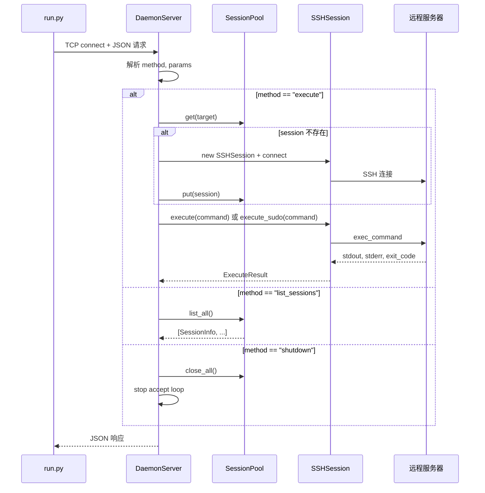
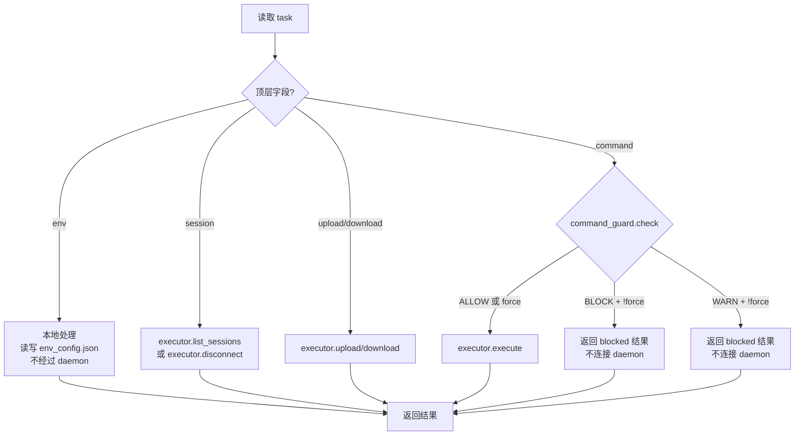
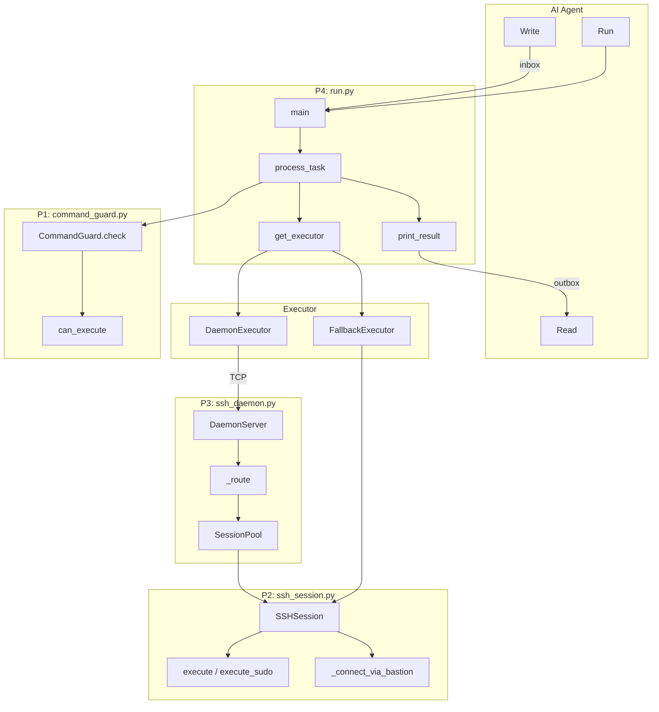

# 《SSH Remote Connection Skill》详细设计说明书

| 项目 | 内容 |
|------|------|
| 文档版本 | V2.0 |
| 编写日期 | 2026-07-22 |
| 编写人 | - |
| 审核人 | - |
| 批准人 | - |
| 文档状态 | 草稿 |

**修订记录**

| 版本 | 日期 | 修改人 | 修改说明 |
|------|------|--------|----------|
| V2.0 | 2026-07-22 | - | 架构重构，对应功能设计 V2.0 |

---

## 1. 引言

### 1.1 编写目的

本文档是 SSH Remote Connection Skill 的详细设计说明书，为编码实现提供精确依据。文档逐模块描述内部算法、数据结构、接口和流程逻辑，程序员应在不参考其他资料的情况下仅凭本文档即可完成编码。

**预期读者**：编码人员、单元测试人员、代码评审人员、后续维护人员。

### 1.2 项目背景

| 项目 | 说明 |
|------|------|
| 软件系统名称 | SSH Remote Connection Skill |
| 任务提出者 | Skill 使用方 |
| 开发者 | 本仓库贡献者 |
| 用户 | 通过 AI Agent 管理远程服务器的运维人员 |
| 部署环境 | AI 运行端（Windows / Linux / macOS），Python 3.x 环境 |

### 1.3 术语与缩略语

| 术语/缩略语 | 定义 |
|-------------|------|
| daemon | 后台守护进程，维持 SSH 连接池 |
| inbox / outbox | AI 写入任务 / 脚本写入结果的目录 |
| JSON-line | 以 \n 分隔的 JSON 对象流，每行一个完整 JSON |
| direct-tcpip | SSH 协议通道类型，用于 TCP 隧道转发 |
| FallbackExecutor | 降级执行器，每次新建 paramiko 直连 |
| DaemonExecutor | 通过 daemon TCP 连接执行命令的执行器 |
| stale | 标记 SSH 会话已失效（心跳失败），需重连 |

### 1.4 参考资料

| 序号 | 文档名称 | 版本 | 来源 |
|------|----------|------|------|
| 1 | 《SSH Remote Connection Skill 功能设计说明书》 | V2.0 | 本仓库 |
| 2 | paramiko 官方文档 | - | https://paramiko.org |
| 3 | SSH 协议规范 (RFC 4254) | - | IETF |
| 4 | 《GB/T 8567-2006 计算机软件文档编制规范》 | 2006 | 国家标准 |

---

## 2. 程序系统的组织结构

### 2.1 模块调用关系



### 2.2 模块清单

| 程序标识符 | 程序（模块）名称 | 所属层次 | 说明 |
|------------|-----------------|----------|------|
| P1 | command_guard.py | CLI 层 | 命令安全过滤器 |
| P2 | ssh_session.py | 会话层 | SSH 会话封装（连接、执行、隧道、SFTP） |
| P3 | ssh_daemon.py | 守护进程层 | TCP 服务 + 连接池管理 |
| P4 | run.py | CLI 层 | 入口脚本，调度 P1 + P3/P2(降级) |

**调用关系**：
- P4 调用 P1（安全检查），再调用 P3（daemon 执行）或 P2（降级直连）
- P3 调用 P2（每个会话一个 SSHSession 实例）
- P2 调用 paramiko（第三方库）

---

## 3. 程序1（P1）设计说明 — command_guard.py

### 3.1.1 程序描述

`command_guard.py` 是一个无状态、无副作用的纯函数式安全检查模块。在命令被传递给 daemon 或远程服务器之前，对命令字符串进行正则匹配，判定其危险级别。本模块常驻于 run.py 进程中，非后台常驻，为顺序调用。

### 3.1.2 功能

| 输入 | 处理 | 输出 |
|------|------|------|
| 命令字符串 command (str) | 遍历 BLOCK 正则列表 → 遍历 WARN 正则列表 → 返回最先匹配的级别 | CheckResult (level, blocked, reason, matched) |
| 命令字符串 + force 标志 | 根据 level 和 force 判定是否可执行 | bool (True=可执行, False=不可执行) |

### 3.1.3 性能

- **时间复杂度**：O(n+m)，n 为 BLOCK 规则数，m 为 WARN 规则数。单次检查耗时 < 1ms
- **内存占用**：仅加载约 22 条预编译正则表达式，可忽略不计

### 3.1.4 输入项

| 名称 | 标识 | 数据类型 | 格式 | 有效范围 | 输入方式 | 来源 | 保密条件 |
|------|------|----------|------|----------|----------|------|------|
| 命令字符串 | command | str | 原始 shell 命令 | 非空字符串 | 函数参数 | run.py | 无 |
| 强制标志 | force | bool | True/False | - | 函数参数 | run.py (来自 task.force) | 无 |

### 3.1.5 输出项

| 名称 | 标识 | 数据类型 | 格式 | 输出方式 | 去向 | 说明 |
|------|------|----------|------|----------|------|------|
| 检查结果 | CheckResult | 数据类 | 4 个字段 | 函数返回值 | run.py | level, blocked, reason, matched |
| 可执行判断 | can_execute() | bool | True/False | 静态方法返回值 | run.py | 综合 level 和 force 的判定 |

### 3.1.6 算法

**匹配算法**：顺序遍历。先遍历 BLOCK 规则的预编译正则列表，逐个 `pattern.search(command)`，首次命中即返回 `CheckResult(level="block", ...)`。BLOCK 未命中再遍历 WARN 列表，首次命中返回 `CheckResult(level="warn", ...)`。均未命中返回 `CheckResult(level="allow", blocked=False)`。

**空命令处理**：`command.strip() == ""` → 直接返回 `CheckResult(level="block", reason="空命令")`。

**can_execute 静态方法**：

| level | force=false | force=true |
|-------|-------------|------------|
| "block" | 不可执行 | 不可执行 |
| "warn" | 不可执行 | **可执行** |
| "allow" | 可执行 | 可执行 |

核心约束：**force 只提升 warn 到 allow，block 始终不可执行**。

**规则结构**：以元组 `(regex_pattern: str, reason: str)` 列表存储。在模块加载时通过 `re.compile()` 预编译为正则对象列表，避免每次检查时重复编译。

### 3.1.7 流程逻辑

```mermaid
flowchart TD
    START([check 被调用]) --> EMPTY{command 为空?}
    EMPTY -->|是| RET_BLOCK_E[返回 BLOCK: "空命令"]
    EMPTY -->|否| BLOCK_LOOP[遍历 block 正则列表]
    BLOCK_LOOP --> MATCH_B{正则匹配?}
    MATCH_B -->|是| RET_BLOCK[返回 CheckResult<br/>level=block, blocked=true]
    MATCH_B -->|否| BLOCK_NEXT{还有下一条?}
    BLOCK_NEXT -->|是| BLOCK_LOOP
    BLOCK_NEXT -->|否| WARN_LOOP[遍历 warn 正则列表]
    WARN_LOOP --> MATCH_W{正则匹配?}
    MATCH_W -->|是| RET_WARN[返回 CheckResult<br/>level=warn, blocked=true]
    MATCH_W -->|否| WARN_NEXT{还有下一条?}
    WARN_NEXT -->|是| WARN_LOOP
    WARN_NEXT -->|否| RET_ALLOW[返回 CheckResult<br/>level=allow, blocked=false]
```

### 3.1.8 接口

| 接口类型 | 模块/对象 | 传递参数 | 参数类型 | 说明 |
|----------|-----------|----------|----------|------|
| 调用本程序的模块 | run.py | command | str | 任务中的命令字段 |
| 调用本程序的模块 | run.py | force | bool | 任务中的 force 字段 |
| 本程序调用的模块 | (无外部依赖) | - | - | - |

### 3.1.9 存储分配

本模块无状态，不分配存储。规则在模块加载时编译为模块级常量，内存占用忽略不计。

### 3.1.10 注释设计

- 模块首部注释：说明功能、规则级别定义、force 行为
- 每条规则的注释：说明拦截原因（已有，见 `reason` 字段）
- can_execute 方法的注释：说明 force 与 level 的组合逻辑

### 3.1.11 限制条件

- 基于正则表达式匹配，无法检测混淆后的命令（如 `r\m -rf /`）。此为已知局限，后续可升级为 AST 分析
- 正则匹配可能产生误报（如合法命令中包含 "rm -rf" 子串出现在参数中而非命令本身）
- 不支持上下文感知检测（如不知道当前工作目录，无法准确判断 `rm -rf .` 是否危险）

### 3.1.12 测试计划

- **测试类型**：白盒单元测试
- **正常输入**：`"ls -la"`、`"cat /etc/hosts"` → 预期 level=allow
- **WARN 输入**：`"rm -rf /tmp/logs"`、`"sed -i 's/a/b/' file.txt"`、`"kill -9 1234"` → 预期 level=warn
- **BLOCK 输入**：`"rm -rf /"`、`"dd if=/dev/zero of=/dev/sda"`、`"mkfs.ext4 /dev/sda1"` → 预期 level=block
- **空命令**：`""`、`"   "` → 预期 level=block
- **边界值**：force=true 时 warn 可执行、block 不可执行
- **误报检验**：`"echo 'rm -rf is dangerous'"` → 预期 level=warn（当前设计会误报）

### 3.1.13 尚未解决的问题

- 正则匹配可能产生的误报（如合法参数中包含危险命令子串）。**处理方式**：WARN 级误报由 AI 向用户确认后 force=true 放行，BLOCK 级误报目前无解决路径，算已知局限
- 无法检测通过 base64 编码、别名等混淆方式绕过的危险命令。**处理方式**：已知技术局限，安全底线最终在用户确认环节

---

## 4. 程序2（P2）设计说明 — ssh_session.py

### 4.2.1 程序描述

`ssh_session.py` 封装单个 SSH 会话的全部操作：连接建立（含跳板机穿透）、命令执行、sudo 提权、文件传输、心跳保活。每个 `SSHSession` 实例对应一条到远程服务器的 SSH 连接。本模块被 `ssh_daemon.py` 的 SessionPool 管理，也在降级模式中被 `FallbackExecutor` 直连使用。

### 4.2.2 功能

| 输入 | 处理 | 输出 |
|------|------|------|
| 连接参数 (host, port, username, password, sudo_password?, bastion_config?) | 选择直连或跳板模式 → paramiko 连接 → 启动心跳 | 连接成功/失败 |
| 命令字符串 + timeout | escalate=true 时走 sudo -S 提权，否则以当前用户直接执行 → exec_command | ExecuteResult (stdout, stderr, exit_code, elapsed) |
| 文件路径 (local, remote) + 方向 | SFTP put/get | 成功/失败 |
| - | 心跳线程每 60s 发送 keepalive | 连接保持/标记 stale |

### 4.2.3 性能

- **连接建立**：直连 < 5s，跳板机 < 10s
- **命令执行**：取决于远程命令本身，无额外开销
- **心跳**：每 60s 一次，耗时 < 1s
- **并发安全**：通过 threading.Lock 保护命令执行通道，同一 session 同一时刻仅允许一条命令

### 4.2.4 输入项

| 名称 | 标识 | 数据类型 | 格式 | 有效范围 | 输入方式 | 来源 | 保密条件 |
|------|------|----------|------|----------|----------|------|------|
| 目标主机 | host | str | IP 地址 | 合法 IP | 构造函数参数 | daemon / run.py | 无 |
| SSH 端口 | port | int | 1-65535 | 默认 22 | 构造函数参数 | 环境配置 | 无 |
| 用户名 | username | str | - | - | 构造函数参数 | 环境配置 | 无 |
| 密码 | password | str | - | - | 构造函数参数 | 环境配置 | 是（不记录日志） |
| sudo 密码 | sudo_password | str? | - | - | 构造函数参数 | 环境配置 (credential) | 是 |
| 跳板机配置 | bastion_config | dict? | {host, port, username, password} | - | 构造函数参数 | 环境配置 (via 解析) | 是 |
| 命令 | command | str | shell 命令 | 非空 | execute() 参数 | daemon / run.py | 无 |
| 超时 | timeout | int | 1-3600 | 默认 30 | execute() 参数 | 任务配置 | 无 |

### 4.2.5 输出项

| 名称 | 标识 | 数据类型 | 格式 | 输出方式 | 去向 | 说明 |
|------|------|----------|------|----------|------|------|
| 执行结果 | ExecuteResult | 数据类 | 含 5 个字段 | 函数返回值 | daemon / run.py | stdout, stderr, exit_code, elapsed |
| 提权需求 | needs_escalation | bool | True/False | ExecuteResult 字段 | daemon / run.py | sudo 不可用时为 True |
| 提权原因 | escalation_reason | str | - | ExecuteResult 字段 | 同上 | 如"sudo 不存在" |
| 提权选项 | escalation_options | list[str] | - | ExecuteResult 字段 | 同上 | 如["enable_root_login"] |
| 连接状态 | is_alive() | bool | True/False | 方法返回值 | daemon（心跳检查） | - |

### 4.2.6 算法

#### 连接建立算法

**直连模式**（无 `bastion_config`）：
1. 创建 paramiko.SSHClient，设置 host key 策略为 AutoAddPolicy
2. 调用 `client.connect(hostname, port, username, password, allow_agent=False, look_for_keys=False, timeout=30)`
3. 返回连接结果

**跳板模式**（有 `bastion_config`）：
1. 从 SessionPool 取（或创建）跳板机的 SSHSession → 确保跳板机连接存活
2. 获取跳板机 transport → `transport.open_channel('direct-tcpip', (target_host, target_port), (bastion_host, bastion_port))` — 建立 TCP 隧道
3. 在隧道 socket 上创建目标机 paramiko.SSHClient → `connect(target_host, username, password, sock=tunnel)`
4. 保存跳板机 SSHSession 引用（目标依赖跳板机，close 时反向通知跳板机，但不关闭跳板机 session）

**连接生命周期**：隧道和 SSH 连接在 connect 时一次性建立，后续 execute/upload/download 直接复用，**不每次重建**。跳板机和目标机各自有心跳线程独立保活。如果跳板机心跳失败被标记 stale，下次访问目标机时也会检测到隧道断开，从而触发从跳板机起整套连接的重建。

#### 命令执行算法

SSHSession 提供两个方法：

**`execute(command, timeout)`**：以当前用户身份直接执行命令，不附加 sudo。

**`execute_sudo(command, timeout)`**：通过 sudo -S 提权执行。前置条件：环境配置中已设置 `sudo_password`。这是兜底方式，优先方式为启用 root 登录（见 `enable_root_login`）。

**`enable_root_login()`**：修改 sshd_config 允许 root 登录并重启 sshd，然后以 root 重连。这是推荐的提权方式（一次性操作，一劳永逸），但需用户一次确认。实现：
1. 通过 `execute_sudo()` 执行 `sed -i` 修改 `/etc/ssh/sshd_config` 中 `PermitRootLogin yes`
2. 通过 `execute_sudo()` 执行 `systemctl restart sshd`
3. 修改自身属性：`self.username = "root"`, `self.password = self.sudo_password`
4. 调用 `self.connect()` 以 root 重建连接

**execute_sudo 实现**：
1. 拼接命令 `sudo -S {command}`
2. 调用 exec_command，向 stdin 通道写入 sudo_password + '\n'
3. shutdown_write() 关闭 stdin，sudo 收到密码后继续执行
4. 分析 stderr 中的 sudo 错误，分类返回 needs_escalation 及具体原因：
   - "sudo: command not found" → reason="sudo 不存在"
   - "not in the sudoers file" → reason="不在 sudoers"
   - "Sorry, try again" → reason="sudo 密码错误"

**权限不足的检测不在 SSHSession 中做**。`execute()` 原样返回 stdout/stderr/exit_code 给 AI，由 AI 判断是否因权限不足导致失败，决定是否用 escalate=true 重试。

#### 心跳算法

在独立 daemon 线程中循环：
1. `sleep(heartbeat_interval)` (默认 60s)
2. `self.execute("echo __KEEPALIVE__", timeout=10)`
3. 异常 → `self._stale = True`，退出循环

### 4.2.7 流程逻辑

**daemon execute handler 的提权分支**：



AI 端的决策流程：
1. 先以当前用户执行命令
2. 查看结果，判断是否权限不足
3. 若需要临时提权 → 重新写入任务 `escalate: true`（走 sudo -S，无需用户确认）
4. 若该环境长期需要 root → 向用户确认后，触发 `enable_root_login`（修改 sshd_config，一劳永逸）
5. `enable_root_login` 成功后，daemon 以 root 重连，后续命令无需再提权

### 4.2.8 接口

| 接口类型 | 模块/对象 | 传递参数 | 参数类型 | 说明 |
|----------|-----------|----------|----------|------|
| 调用本程序的模块 | SessionPool (P3) | SSHSession(host, port, username, password, ...) | 构造函数 | 创建会话 |
| 调用本程序的模块 | SessionPool (P3) | session.execute(command, timeout) 或 session.execute_sudo(command, timeout) | str, int | 普通执行 / sudo 提权执行 |
| 调用本程序的模块 | FallbackExecutor (P4) | 同上 | - | 降级直连 |
| 本程序调用的模块 | paramiko.SSHClient | - | - | SSH 连接和命令执行 |
| 本程序调用的模块 | paramiko.SFTPClient | - | - | 文件传输 |
| 本程序调用的模块 | paramiko.Transport.open_channel | 'direct-tcpip', ... | - | 跳板机隧道建立 |

### 4.2.9 存储分配

- 每个 SSHSession 维护一个 paramiko.SSHClient + 可选的 SFTPClient
- 跳板机场景：目标 session 持有跳板机 session 的引用（用于隧道建立和后续感知跳板机存活状态），但跳板机 session 的关闭独立于目标 session
- 心跳线程为 daemon thread，不阻止进程退出
- SFTP 为惰性初始化（首次 upload/download 时 `open_sftp()`）

### 4.2.10 注释设计

- 模块首部：说明会话生命周期、线程安全策略、与 daemon 的关系
- execute / execute_sudo 方法：说明普通执行和提权执行的分工，提权由 AI 通过 escalate 字段触发
- _connect_via_bastion 方法：说明 direct-tcpip 隧道建立原理、隧道一次性创建不复建、目标 session 与跳板机 session 的依赖关系
- _execute_sudo：说明 stdin 管道送密码 + shutdown_write 的作用

### 4.2.11 限制条件

- 同一 session 的 execute 调用受 `threading.Lock` 保护，命令串行执行
- 跳板机仅支持一级（一次 via），不支持链式多跳
- 心跳使用 `exec_command` 而非 transport 层 keepalive，因为 paramiko 的 transport keepalive 配置复杂
- `enable_root_login` 假定 sshd 使用 systemd 管理，非 systemd 系统需手动修改脚本

### 4.2.12 测试计划

- **连接测试**：直连成功/失败、跳板机连接成功/失败、密钥/密码认证
- **命令测试**：简单命令 ("echo hello")、管道命令、超时命令 ("sleep 100")、超大输出命令
- **sudo 测试**：root 用户跳过提权、sudo_password 正确提权、密码错误返回 needs_escalation
- **跳板机测试**：via 配置的自动解析、跳板机不可达的错误处理
- **心跳测试**：连接空闲 120s 后仍可执行命令、心跳失败后 stale 标记正确
- **SFTP 测试**：上传/下载小文件、大文件、不存在的路径

### 4.2.13 尚未解决的问题

- 多级跳板机链（A → B → C）未实现。**处理方式**：当前仅支持一级，使用场景较少，待有需求时再扩展
- enable_root_login 对非 systemd 系统需要手动适配。**处理方式**：当前仅兼容 systemd，非 systemd 系统（CentOS 6 等）待有需求时再扩展
- 心跳仅检测 SSH 层，不检测到 SFTP channel 是否正常。**处理方式**：SFTP 为惰性初始化，使用前发现失效自然会报错，无需额外检测

---

## 5. 程序3（P3）设计说明 — ssh_daemon.py

### 5.3.1 程序描述

`ssh_daemon.py` 是一个后台常驻的 TCP 服务器，监听 `localhost:19522`，使用 JSON-line 协议与 `run.py` 通信。内部维护一个 `SessionPool`，管理多个到不同 target 的 `SSHSession`。负责空闲会话回收。本程序作为独立进程运行（由 run.py 通过 subprocess.Popen 启动），应常驻且不自动退出。

### 5.3.2 功能

| 输入 | 处理 | 输出 |
|------|------|------|
| TCP 连接上的 JSON 请求 | 路由到对应 handler → 操作 SessionPool → 调用 SSHSession 方法 | JSON 响应 |
| 定时器 (120s) | 遍历 SessionPool → 关闭空闲超过 300s 的会话 | 会话回收 |
| shutdown 请求 | 关闭所有会话 → 停止 accept 循环 → exit(0) | 进程退出 |

### 5.3.3 性能

- **并发能力**：每客户端连接一个线程，连接内请求串行。通常 run.py 是唯一客户端，实际无并发冲突
- **会话容量**：SessionPool 无上限，受系统文件描述符限制
- **TCP 协议**：每行 JSON 请求+响应，无长连接解析压力

### 5.3.4 输入项

| 名称 | 标识 | 数据类型 | 格式 | 有效范围 | 输入方式 | 来源 | 保密条件 |
|------|------|----------|------|----------|----------|------|------|
| JSON 请求 | request | dict | JSON-line | 见接口章节 | TCP socket | run.py | 否 |
| 环境配置 | env_config | dict | JSON 文件 | - | 文件读取 | 启动参数 | 是（密码字段不输出到日志） |

### 5.3.5 输出项

| 名称 | 标识 | 数据类型 | 格式 | 输出方式 | 去向 | 说明 |
|------|------|----------|------|----------|------|------|
| JSON 响应 | response | dict | JSON-line | TCP socket | run.py | result 或 error 两种格式 |
| 会话列表 | list_sessions | dict | JSON | 同上 | run.py | 含 sessions 数组 |
| 日志信息 | stderr | 文本 | - | 进程 stderr | 终端/日志 | 启动、回收、异常 |

### 5.3.6 算法

#### 请求路由算法

```
1. 从 socket 逐行读取 JSON → 解析为 {id, method, params}
2. 查 handlers 字典 {method: handler_function}
3. 调用 handler_function(params)
4. 返回 {"id": id, "result": handler_result} 或 {"id": id, "error": {...}}
5. 未知 method → 返回 error: INVALID_PARAMS
```

#### execute handler 算法

```
1. 从 params 中提取 target, command, timeout, as(可选), escalate(可选)
2. 解析 target (查 env_config environments)
3. 确定凭证: as 指定 → 查找对应 credential; 未指定 → 使用 default_credential
4. session_key = host + ":" + credential_name  （按 IP 精确匹配）
5. pool.get(session_key) — 查找已有 session
6. 若未找到:
   a. 从 credential 中获取 username, password, sudo_password
   b. 若有 via 字段 → 递归解析跳板机配置
   c. 创建 SSHSession 实例 → connect()
   d. pool.put(session_key, session)
7. 若 params.escalate=true → session.execute_sudo(command, timeout)
   否则 → session.execute(command, timeout)
8. 更新 session.last_activity
9. 返回结果
```

#### 空闲回收算法

```
 cleanup_loop (后台线程，每 120s 循环):
   for each session in pool:
     idle_seconds = now() - session.last_activity
     if idle_seconds > session_idle_timeout (默认300s):
       session.close()
       pool.remove(session_key)  # session_key = host:credential_name
   # daemon 不主动退出
```

### 5.3.7 流程逻辑

**请求处理流程**：



### 5.3.8 接口

| 接口类型 | 模块/对象 | 传递参数 | 参数类型 | 说明 |
|----------|-----------|----------|----------|------|
| 调用本程序的模块 | run.py (DaemonExecutor) | TCP JSON 请求 | dict | 见协议章节 |
| 本程序调用的模块 | SSHSession (P2) | 构造函数 + execute/upload/download | - | 会话操作 |
| 本程序调用的模块 | SessionPool | get/put/remove/list_all/close_all | - | 连接池管理 |

### 5.3.9 存储分配

- `SessionPool._sessions`: dict[str, SSHSession]，key 为 `host:credential_name`（按 IP 匹配），常驻内存
- `DaemonServer._server_socket`: 单个 TCP socket，常驻
- 客户端连接 socket：临时分配，请求处理完毕后关闭（或复用）

### 5.3.10 注释设计

- DaemonServer 类：说明生命周期（常驻不退出）、端口绑定、线程模型
- _route 方法：说明路由分发逻辑
- _handle_execute：说明 target + credential 解析、session 键的组成 (host:credential_name)、自动 connect 逻辑
- _cleanup_loop：说明回收策略（仅回收会话，不退出进程）

### 5.3.11 限制条件

- 仅监听 localhost，不具备远程管理能力
- 不支持 TLS/SSL 加密（本地通信无需）
- 无身份认证机制（依赖 localhost 的 OS 隔离）
- JSON-line 协议不支持二进制数据直接传输（文件传输走 SFTP channel）

### 5.3.12 测试计划

- **启动测试**：绑定端口、写入启动日志
- **ping 测试**：发送 ping 请求，验证响应
- **connect + execute 测试**：完整连接-执行-复用流程
- **会话复用测试**：同一 target 两次 execute，验证仅一次登录
- **空闲回收测试**：模拟会话 300s+ 无活动，验证被回收
- **shutdown 测试**：验证所有会话关闭、端口释放、进程退出
- **异常测试**：无效 JSON、未知 method、SSH 连接失败

### 5.3.13 尚未解决的问题

- daemon 崩溃后恢复依赖 run.py 重试拉起，自身无 watchdog。**处理方式**：run.py 自动重试拉起已覆盖，无需额外进程监控
- 多客户端并发瓶颈。**处理方式**：当前仅 run.py 单客户端访问，无实际影响，待有需求再改

---

## 6. 程序4（P4）设计说明 — run.py

### 6.4.1 程序描述

`run.py` 是本 Skill 的 CLI 入口，也是 AI Agent 与脚本系统的唯一交互点。它以**无参数**方式运行，扫描 `inbox/` 目录获取待执行任务，经安全检查后转发给 daemon 执行（或降级为直连），将结果写入 `outbox/` 并在 stdout 输出。本程序非后台常驻，每次调用独立运行。

### 6.4.2 功能

| 输入 | 处理 | 输出 |
|------|------|------|
| inbox 目录中的 JSON 任务文件 | 扫描、排序、解析 → 安全检查 → 连接 daemon 或降级 → 执行 → 写 `outbox/result.json` | `outbox/result.json` + stdout 输出 |
| --json 命令行参数 (兼容) | 解析 → 写入 inbox → 走正常流程 | 同上 |

### 6.4.3 性能

- **启动耗时**：< 0.5s（不含 daemon 拉起重试）
- **daemon 拉起重试**：最多 3 次 × (2s 等待 + ~2s 启动) ≈ 12s
- **任务处理**：取决于命令本身 + 网络延迟

### 6.4.4 输入项

| 名称 | 标识 | 数据类型 | 格式 | 有效范围 | 输入方式 | 来源 | 保密条件 |
|------|------|----------|------|----------|----------|------|------|
| inbox 任务文件 | task | JSON 文件 | 见功能设计 4.3.1 | - | 文件系统扫描 | AI (Write 工具) | 否 |
| --json 参数 (兼容) | json_str | str | JSON 字符串 | - | 命令行参数 | AI (Run 工具) | 否 |

### 6.4.5 输出项

| 名称 | 标识 | 数据类型 | 格式 | 输出方式 | 去向 | 说明 |
|------|------|----------|------|----------|------|------|
| 结果文件 | result | JSON 文件 | 见功能设计 4.3.1 | outbox/result.json | AI (Read 工具) | 完整输出 |
| stdout 输出 | - | 文本流 | 命令 stdout/stderr + 文件路径 | 进程 stdout | AI (Run 工具) | 预览用 |
| stderr 输出 | - | 文本流 | 错误/警告/状态信息 | 进程 stderr | AI (Run 工具) | 运维日志 |

### 6.4.6 算法

#### 主流程算法

```
1. 检查 sys.argv 是否含 --json
   是 → 解析 JSON → 赋予 task_id → 写入 inbox → 继续步骤 2
2. 扫描 inbox/ 目录 → 按文件名排序 → 得到 tasks 列表
3. 如果 tasks 为空 → stderr 输出 "没有待执行的任务" → exit(0)
4. 初始化 CommandGuard, get_executor()
5. for each task in tasks:
     result = process_task(task, guard, executor)
     写入 outbox/result.json（覆写已有同名文件）
     print_result(result)
     删除 inbox/task.json
6. executor.close()
```

#### process_task 算法

```
1. 如果 task 含有 "env" 字段:
     env 值为 "add"/"update"/"remove"/"list"/"credential_add"/"credential_remove"
     → 本地处理（读写 env_config.json，不经过 daemon）
2. 如果 task 含有 "session" 字段:
     session == "list" → executor.list_sessions()
     session == "disconnect" → executor.disconnect(task.target)
     (跳过安全检查)
3. 如果 task 含有 "upload" 或 "download":
     直接转发给 executor.upload/download (跳过安全检查)
4. 如果 task 含有 "command":
     result = guard.check(command)
     如果 !guard.can_execute(result.level, task.force):
       返回 blocked 结果 (不连接 daemon)
     否则:
       executor.execute(target, command, timeout)
```

#### get_executor 算法

```
1. 尝试 TCP 连接 daemon 端口 (localhost:19522)
   成功 → 返回 DaemonExecutor(sock)
2. for attempt = 1 to 3:
     try:
       subprocess.Popen 启动 ssh_daemon.py (后台)
       轮询端口, timeout=5s
       成功 → 返回 DaemonExecutor(sock)
     catch Exception as e:
       stderr: "daemon 启动失败 (第 n/3 次): {e}"
     sleep(2s)
3. stderr: 逐条输出每次重试的失败原因（含异常类型和消息）
   stderr: "daemon 无法启动 (已重试 3 次)，降级为直连模式"
   stderr: "请根据以上错误排查或联系管理员"
   返回 FallbackExecutor()
```

#### print_result 算法

```
1. 如果 result.blocked:
     stdout: "[BLOCKED] {reason}"
   else:
     如果 result.stdout 非空: stdout: result.stdout
     如果 result.stderr 非空: stderr: result.stderr
2. stdout: "[完整结果: outbox/result.json]"
3. 如果 blocked 且有 force 提示: stdout: "[提示: 强制执行请设置 force=true]"
```

### 6.4.7 流程逻辑

**process_task 调度流程**：



### 6.4.8 接口

| 接口类型 | 模块/对象 | 传递参数 | 参数类型 | 说明 |
|----------|-----------|----------|----------|------|
| 调用本程序的模块 | AI Agent (Run 工具) | 无参数 (或 --json) | - | 唯一调用方 |
| 本程序调用的模块 | CommandGuard (P1) | command, force | str, bool | 安全检查 |
| 本程序调用的模块 | DaemonExecutor → ssh_daemon (P3) | TCP JSON 请求 | dict | 正常执行 |
| 本程序调用的模块 | FallbackExecutor → SSHSession (P2) | 构造函数 + execute | - | 降级执行 |
| 关联数据结构 | inbox/outbox 文件系统 | - | - | 任务和结果持久化 |

### 6.4.9 存储分配

- 任务列表：内存中持有 inbox 扫描结果，批处理完毕后释放
- 结果文件：每次任务立即写入 `outbox/result.json`（不是攒批），防止进程异常丢失结果
- CommandGuard / Executor：单次调用内复用

### 6.4.10 注释设计

- main 函数：说明整体流程（扫描 → 检查 → 执行 → 输出）
- process_task：说明操作类型分发规则（env → session → upload/download → command）
- get_executor：说明拉起重试策略（不判断原因、统一重试、耗尽降级）
- print_result：说明输出原则（原样不截断 + 末尾文件路径）

### 6.4.11 限制条件

- 单进程单线程处理 inbox 任务，不并行执行
- 降级模式下每任务新建连接，不享受长连接收益
- --json 兼容模式存在 Shell 转义风险（仅降级推荐使用）

### 6.4.12 测试计划

- **inbox 空目录**：预期 stderr "没有待执行的任务"，退出码 0
- **单个命令任务**：完整 Write → Run → Read 流程
- **多个命令任务**：验证按文件名排序执行
- **session/env 任务**：`session`（daemon 会话管理）、`env`（本地环境配置）跳过安全检查
- **BLOCK 命令**：验证返回 blocked 且不连接 daemon
- **WARN 命令 force=false**：同上
- **WARN 命令 force=true**：验证放行执行
- **daemon 端口不通**：验证重试拉起流程
- **daemon 持续不可用**：验证降级后仍可执行命令
- **--json 兼容模式**：验证写入 inbox 后走正常流程

### 6.4.13 尚未解决的问题

- 不支持任务并行执行。**处理方式**：AI 覆写同一 task.json，通常只有一个任务，无并行需求
- 任务失败后无自动重试。**处理方式**：重试策略由 AI 自行决定（换命令、提权、换凭证等），脚本不做自动重试

---

## 7. 公共数据结构设计

### 7.1 全局常量与变量定义

| 名称 | 类型 | 取值范围 | 初始值 | 说明 |
|------|------|----------|--------|------|
| INBOX_DIR | Path | - | ssh-connect/inbox/ | 任务输入目录 |
| OUTBOX_DIR | Path | - | ssh-connect/outbox/ | 结果输出目录 |
| DAEMON_HOST | str | - | 127.0.0.1 | daemon 监听地址 |
| DAEMON_PORT | int | 1024-65535 | 19522 | daemon 监听端口 |
| MAX_RETRIES | int | - | 3 | daemon 拉起重试上限 |
| RETRY_DELAY | int | - | 2 | 重试间隔(秒) |
| HEARTBEAT_INTERVAL | int | - | 60 | 心跳间隔(秒) |
| SESSION_IDLE_TIMEOUT | int | - | 300 | 会话空闲超时(秒) |

### 7.2 公共数据结构定义

#### ExecuteResult

执行结果数据类，被 P2、P3、P4 共享使用：

| 字段 | 类型 | 说明 |
|------|------|------|
| stdout | str | 标准输出 |
| stderr | str | 标准错误 |
| exit_code | int | 命令退出码 |
| elapsed | float | 执行耗时(秒) |
| needs_sudo | bool | 是否需要 sudo（默认 False） |
| needs_escalation | bool | 是否需要提权（默认 False） |
| escalation_reason | str? | 提权失败原因 |
| escalation_options | list[str] | 可选提权方案 |

#### CheckResult

安全检查结果数据类：

| 字段 | 类型 | 说明 |
|------|------|------|
| level | str | "block" / "warn" / "allow" |
| blocked | bool | 是否被拦截 |
| reason | str? | 拦截原因 |
| matched | str? | 匹配到的正则模式 |

#### SessionInfo

会话元信息（不含连接和凭证），用于 list_sessions 返回：

| 字段 | 类型 | 说明 |
|------|------|------|
| session_id | str (UUID) | 会话标识 |
| target | str | 目标 IP |
| credential_name | str | 凭证名称（如 "admin"、"root"） |
| host | str | 服务器 IP |
| username | str | 登录用户 |
| created_at | float | 创建时间戳 |
| last_activity | float | 最后活跃时间戳 |
| idle_seconds | int | 空闲秒数 |

### 7.3 错误码定义

| 错误码 | 含义 | 触发条件 | 处理方式 |
|--------|------|----------|----------|
| SESSION_NOT_FOUND | 会话不存在 | target 无活跃 session | 返回错误，由调用方决定是否新建 |
| TARGET_NOT_FOUND | target 无法解析 | IP 在 env_config 中未配置 | 返回错误给 AI |
| CONNECT_FAILED | SSH 连接失败 | 认证失败、超时、网络不可达 | 返回详细错误信息给 AI |
| COMMAND_TIMEOUT | 命令执行超时 | 超过 task.timeout 秒 | 返回超时错误 |
| SUDO_REQUIRED | 需要提权 | 非 root 且 sudo_password 未配置 | 返回 needs_sudo=True |
| SUDO_DENIED | sudo 执行失败 | 密码错误、不在 sudoers 等 | 返回 needs_escalation=True |
| SFTP_ERROR | 文件传输错误 | 文件不存在、权限不足、磁盘满 | 返回错误详情 |
| INVALID_PARAMS | 参数不合法 | JSON 格式错误、字段缺失、类型不匹配 | 返回参数错误 |

---

## 8. 接口详细设计

### 8.1 内部接口

#### IF-01: inbox 任务文件 (AI → run.py)

| 项目 | 说明 |
|------|------|
| 接口名称 | inbox 任务文件 |
| 提供方 | AI Agent (Write 工具) |
| 调用方 | run.py (文件系统扫描) |
| 协议/方式 | 文件系统 (JSON 文件) |
| 路径 | ssh-connect/inbox/task.json |

**请求格式 (执行命令)**：
```json
{
    "task_id": "20260722_120000_001",
    "target": "192.168.1.100",
    "command": "free -h",
    "timeout": 30,
    "force": false,
    "escalate": false,
    "as": "root"
}
```

| 字段 | 说明 |
|------|------|
| force | 可选，默认 false。设为 true 后跳过 WARN 级安全检查 |
| escalate | 可选，默认 false。设为 true 时用当前凭证的 sudo_password 提权执行 |
| as | 可选。指定使用哪组凭证登录。不填则使用环境的 default_credential |

**请求格式 (上传文件)**：
```json
{
    "task_id": "20260722_120000_002",
    "target": "192.168.1.100",
    "upload": {
        "local": "C:/Users/xxx/app.jar",
        "remote": "/opt/app/app.jar"
    }
}
```

**请求格式 (会话管理)**：
```json
{
    "task_id": "20260722_120000_003",
    "session": "list"
}
```
```json
{
    "task_id": "20260722_120000_004",
    "session": "disconnect",
    "target": "192.168.1.100"
}
```

**请求格式 (环境管理)**：

添加含多组凭证的环境：
```json
{
    "task_id": "20260722_env_001",
    "env": "add",
    "env_name": "192.168.1.100",
    "config": {
        "host": "192.168.1.100",
        "credentials": [
            {
                "name": "admin",
                "username": "admin",
                "password": "123",
                "sudo_password": "456"
            },
            {
                "name": "root",
                "username": "root",
                "password": "456"
            }
        ],
        "default_credential": "admin"
    }
}
```

为已有环境新增凭证：
```json
{
    "task_id": "20260722_c_001",
    "env": "credential_add",
    "env_name": "192.168.1.100",
    "credential": {
        "name": "deploy",
        "username": "deploy",
        "password": "deploy_pass"
    }
}
```

查询、删除：
```json
{
    "task_id": "20260722_env_004",
    "env": "list"
}
```
```json
{
    "task_id": "20260722_env_005",
    "env": "remove",
    "env_name": "192.168.1.100"
}
```

环境管理操作由 run.py 本地处理（读写 env_config.json），不经过 daemon。校验规则：host/credentials 必填；credentials 至少一组；每组 name/username/password 必填；name 在同一 IP 内唯一；default_credential 必须匹配一组凭证的 name；via 填写的 IP 必须在 environments 中已配置；env_name 即 IP，重复录入则覆盖。

#### IF-02: outbox 结果文件 (run.py → AI)

| 项目 | 说明 |
|------|------|
| 接口名称 | outbox 结果文件 |
| 提供方 | run.py |
| 调用方 | AI Agent (Read 工具) |
| 协议/方式 | 文件系统 (JSON 文件) |
| 路径 | ssh-connect/outbox/result.json |

**正常结果格式**：
```json
{
    "task_id": "20260722_120000_001",
    "success": true,
    "exit_code": 0,
    "stdout": "Mem: 7.6G ...",
    "stderr": "",
    "elapsed": 1.23,
    "blocked": false
}
```

**被拦截结果格式**：
```json
{
    "task_id": "20260722_120000_001",
    "success": false,
    "exit_code": 1,
    "stdout": "",
    "stderr": "",
    "elapsed": 0.01,
    "blocked": true,
    "level": "warn",
    "reason": "递归强制删除: rm -rf /tmp/logs/*"
}
```

**list_sessions 结果格式**：
```json
{
    "task_id": "20260722_120000_003",
    "success": true,
    "sessions": [
        {
            "target": "192.168.1.100",
            "host": "192.168.1.100",
            "credential_name": "admin",
            "username": "admin",
            "idle_seconds": 45
        }
    ]
}
```

#### IF-03: Daemon RPC (run.py ↔ ssh_daemon)

| 项目 | 说明 |
|------|------|
| 接口名称 | Daemon RPC |
| 提供方 | ssh_daemon.py (TCP Server) |
| 调用方 | run.py (DaemonExecutor) |
| 协议/方式 | TCP (localhost:19522), JSON-line |
| 超时 | 连接 5s, 请求 3600s (最大命令超时) |
| 重试策略 | 连接失败由 run.py 重试拉起 daemon (3次) |

**请求格式**：
```json
{"id": "req-001", "method": "ping", "params": {}}
{"id": "req-002", "method": "execute", "params": {"target": "192.168.1.100", "command": "free -h", "timeout": 30, "escalate": false}}
{"id": "req-003", "method": "connect", "params": {"target": "192.168.1.100", "host": "192.168.1.100", "port": 22, "username": "root", "password": "xxx"}}
{"id": "req-004", "method": "list_sessions", "params": {}}
{"id": "req-005", "method": "disconnect", "params": {"target": "192.168.1.100"}}
{"id": "req-006", "method": "shutdown", "params": {}}
```

**响应格式（成功）**：
```json
{"id": "req-001", "result": {"status": "ok"}}
{"id": "req-002", "result": {"stdout": "...", "stderr": "...", "exit_code": 0, "elapsed": 1.23}}
{"id": "req-003", "result": {"session_id": "abc123", "host": "192.168.1.100", "username": "root"}}
```

**响应格式（错误）**：
```json
{"id": "req-002", "error": {"code": "COMMAND_TIMEOUT", "message": "命令执行超时 (30s)"}}
```

**方法清单**：

| 方法 | 参数 | 返回 | 说明 |
|------|------|------|------|
| ping | {} | {status} | 健康检查 |
| connect | target, host, port, username, password, sudo_password?, via_* | {session_id} | 幂等：已有同 target:credential session 则返回已有 id |
| execute | target, command, timeout, escalate?, as? | {stdout, stderr, exit_code, elapsed} | 自动连接；as 指定凭证，escalate=true 时 sudo 提权 |
| upload | target, local, remote | {success} | SFTP 上传 |
| download | target, remote, local | {success} | SFTP 下载 |
| disconnect | target | {} | 关闭并移除会话 |
| list_sessions | {} | {sessions} | 不含凭证信息 |
| is_connected | target | {connected, session_id} | 查询指定 target 是否已连接 |
| shutdown | {} | {} | 关闭所有会话 + 退出进程 |

### 8.2 外部接口

本 Skill 无外部系统接口。与远程 Linux 服务器的 SSH 通信使用 paramiko 库，属于底层依赖而非外部接口。

---

## 9. 需求追踪矩阵

| 需求编号 | 需求名称 | 概要设计章节 | 详细设计章节 | 状态 |
|----------|----------|-------------|-------------|------|
| REQ-F1 | 文件桥接模式 | 功能设计 3.1 | 程序4 (run.py) | 已覆盖 |
| REQ-F2 | 长连接会话管理 | 功能设计 3.2 | 程序3 (ssh_daemon.py), 程序2 (心跳) | 已覆盖 |
| REQ-F3 | 降级兜底 | 功能设计 3.3 | 程序4 (get_executor), 程序2 (FallbackExecutor) | 已覆盖 |
| REQ-F4 | 结果完整性保障 | 功能设计 3.4 | 程序4 (print_result) | 已覆盖 |
| REQ-F5 | 危险命令控制 | 功能设计 3.5 | 程序1 (command_guard.py) | 已覆盖 |
| REQ-F6 | Sudo 提权 | 功能设计 3.6 | 程序2 (execute / execute_sudo / daemon handler 的 escalate 分支) | 已覆盖 |
| REQ-F7 | 跳板机透明穿透 | 功能设计 3.7 | 程序2 (_connect_via_bastion) | 已覆盖 |
| REQ-F8 | 环境配置管理 | 功能设计 3.8 | 功能设计 5.2.1 (数据结构) | 已覆盖 |
| REQ-F9 | 文件传输 | 功能设计 3.9 | 程序2 (upload/download) | 已覆盖 |

---

## 10. 附录

### 10.1 Daemon RPC 完整报文示例

**ping 请求/响应**：
```
→ {"id":"1","method":"ping","params":{}}
← {"id":"1","result":{"status":"ok"}}
```

**execute 完整请求/响应**：
```
→ {"id":"2","method":"execute","params":{"target":"192.168.1.100","command":"free -h","timeout":30,"escalate":false,"as":"root"}}
← {"id":"2","result":{"stdout":"              total        used        free      shared  buff/cache   available\nMem:           7.6G        2.1G        3.2G        112M        2.3G        5.1G\nSwap:          2.0G          0B        2.0G","stderr":"","exit_code":0,"elapsed":1.23}}
```

**connect (含跳板机)**：
```
→ {"id":"3","method":"connect","params":{"target":"10.0.1.5","host":"10.0.1.5","port":22,"username":"app","password":"app_pwd","sudo_password":"root_pwd","via_host":"203.0.113.1","via_port":22,"via_username":"ops","via_password":"ops_pwd"}}
← {"id":"3","result":{"session_id":"abc123","host":"10.0.1.5","username":"app"}}
```

### 10.2 模块调用关系总图



---

## 11. SKILL.md 适配要点

当前 SKILL.md 为 v1.0 内容，需按以下清单逐项适配 v2.0 设计。**以下各条若未在 SKILL.md 中体现，AI 将按旧版行为操作，导致功能不可用或行为错误。**

### 11.1 配置结构变更

| v1.0 现状 | v2.0 要求 | 适配说明 |
|-----------|-----------|----------|
| 单账号：`username`/`password`/`root_password` 在环境顶层 | 多凭证：`credentials` 数组，每组含 `name`/`username`/`password`/`sudo_password` | SKILL.md 第 41-48 行的配置字段说明需全部替换 |
| 无 default_credential | 新增 `default_credential` 字段 | 需在 SKILL.md 中说明其作用 |
| 环境名由用户指定 | 环境 key 固定为 IP 地址 | env: "add" 时 env_name 即 IP，无需用户起名 |
| AI 直接编辑 JSON 保存配置 | AI 通过 `env: "add"` / `env: "credential_add"` 调用脚本录入 | SKILL.md 中"引导创建配置"流程改为调用 env，不再写 Python 命令拼接 JSON |

### 11.2 调用方式变更

| v1.0 现状 | v2.0 要求 | 适配说明 |
|-----------|-----------|----------|
| `python smart_connect.py --json '...'` | 文件桥接：Write inbox → Run → Read outbox (三步) | SKILL.md 第 186-199 行全部替换 |
| 命令通过 --json 传参 | 命令通过 inbox JSON 文件传递，run.py 无参数 | 需说明"Why"：避免 Shell 转义 |

### 11.3 权限提升变更

| v1.0 现状 | v2.0 要求 | 适配说明 |
|-----------|-----------|----------|
| "自动检测密码提示并填写" | **不自动提权**，先普通执行；权限不足时 AI 决定如何提权 | SKILL.md 第 71-79 行需全面修改 |
| "su - 切换到 root shell" | 废弃 `su -` 方式，改用 `sudo -S` + stdin 管道送密码 | |
| 无 as 字段 | 新增 `as` 字段，AI 可通过切换凭证来获得更高权限 | 需说明 `as` 与 `escalate` 的关系 |
| 无提权策略优先级 | **首选**：改 sshd_config 允许 root 登录（一次确认，一劳永逸）。**兜底**：escalate=true 走 sudo -S（每次一次，无需确认） | AI 应主动向用户建议启用 root 登录，尤其是频繁需要 root 的环境 |

### 11.4 新增功能字段

以下字段在 v1.0 SKILL.md 中不存在，需在"调用格式"章节补充：

| 字段 | 默认值 | 说明 |
|------|--------|------|
| `force` | false | 设为 true 后跳过 WARN 级安全检查。用户确认后方可设置 |
| `escalate` | false | 设为 true 后用当前凭证的 sudo_password 提权执行 |
| `as` | 不填 | 指定使用哪组凭证登录。不填使用 default_credential |
| `session` | - | 会话管理：`"list"` 查看 / `"disconnect"` 断开 |
| `env` | - | 环境管理：`"add"` / `"update"` / `"remove"` / `"list"` / `"credential_add"` / `"credential_remove"` |
### 11.5 危险命令控制

v1.0 SKILL.md 无此概念，需新增完整章节：

- 说明 BLOCK / WARN / ALLOW 三级拦截
- AI 看到 `[BLOCKED]` 时必须向用户展示命令和原因
- 用户确认后 AI 重新写入任务并设 `force: true`
- BLOCK 级别（如 `rm -rf /`）即使 force=true 也不放行

### 11.6 结果完整性

v1.0 SKILL.md 无此概念，需新增：

- AI 先读取 Run 工具的 stdout 输出
- stdout 末尾有一行 `[完整结果: outbox/result.json]`
- **禁止**在读取完整 outbox 文件前换命令重试
- 仅当 stdout 被截断**且**截断前的内容不包含所需信息时，才 Read outbox
- stdout 完整或已包含所需信息时，无需额外读文件

### 11.7 会话管理

v1.0 SKILL.md 无此概念，需新增：

- `session: "list"` — 查看 daemon 中活跃会话
- `session: "disconnect"` — 手动断开指定环境的连接
- 这些操作同样走文件桥接模式

### 11.9 文件复用

v1.0 SKILL.md 无此概念，需新增：

- inbox 文件固定命名为 `inbox/task.json`，outbox 固定命名为 `outbox/result.json`
- AI 每次 Write 覆写同一文件，不新建。task_id 仅存在于 JSON body 中
- task_id 格式：`task_N`（N 递增，如 `task_1`、`task_2`）。重试时**必须用同一个 task_id**，不可换
- 避免 inbox/outbox 目录堆积临时文件

### 11.8 跳板机

v1.0 SKILL.md 无此概念，需新增：

- 环境配置中通过 `via` 字段声明跳板关系，via 值为跳板机 IP
- AI 执行命令时只需指定目标 IP，脚本自动处理跳板
- 配置时跳板机先录入，目标机后用 `via` 引用跳板机 IP

---

*文档结束*
